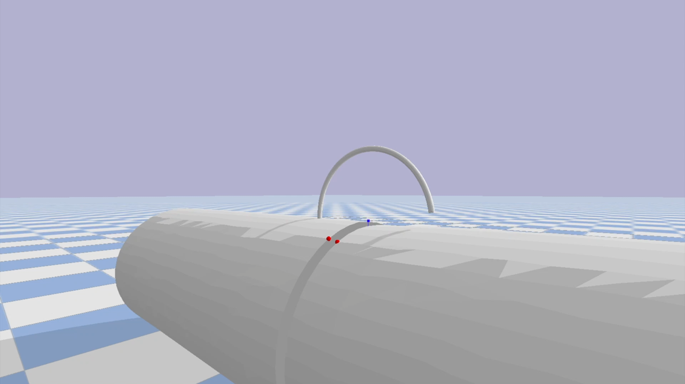

# Robotic Anastomosis: Trajectory & Geometry Evaluation 🤖🪡
*Academic Project | Politecnico di Milano | Oct. 2024 - Feb. 2025*

*Pybullet simulation environment for needle insertion and tissue interaction.*

## 📌 Project Overview
This repository contains the configuration of a computational workflow designed to evaluate robotic suturing kinematics. The primary goal is to simulate the insertion of a surgical needle into soft tissue, setting up an optimization routine to find the most suitable needle geometry and entry trajectory.

**Key Activities:**
* Configuration of a 3D physical simulation environment to replicate tissue constraints.
* Adaptation of kinematic optimization routines to compute the needle geometry parameters, minimizing simulated tissue damage.
* Extraction and visualization of trajectory data to evaluate the robustness of the optimized outcome.

📄 **[Click here to read the full Technical Report (PDF)](Robotic_Anastomosis_Report.pdf)** for a detailed breakdown of the kinematics, the mathematical formulation, and the simulation parameters.

---

## 🛠️ Tech Stack & Tools
* **Language:** Python
* **Physics Engine / Simulation:** Pybullet
* **Numerical Computing:** NumPy
* **Optimization:** SciPy (`scipy.optimize`)
